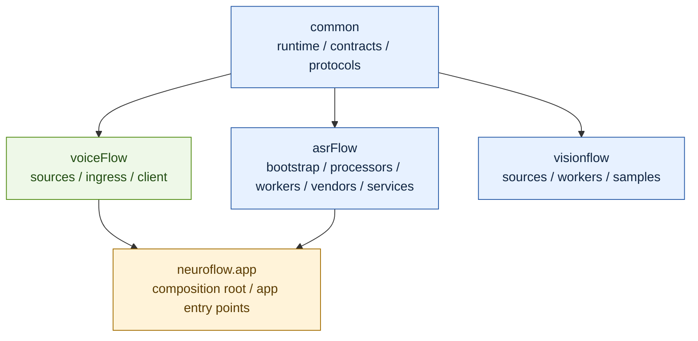
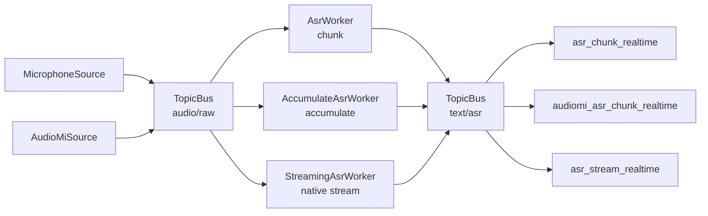
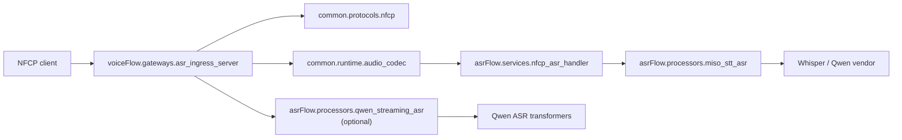
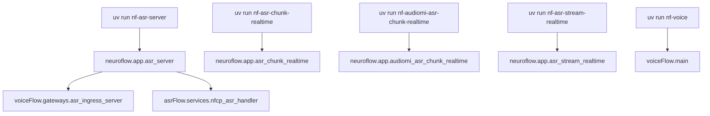
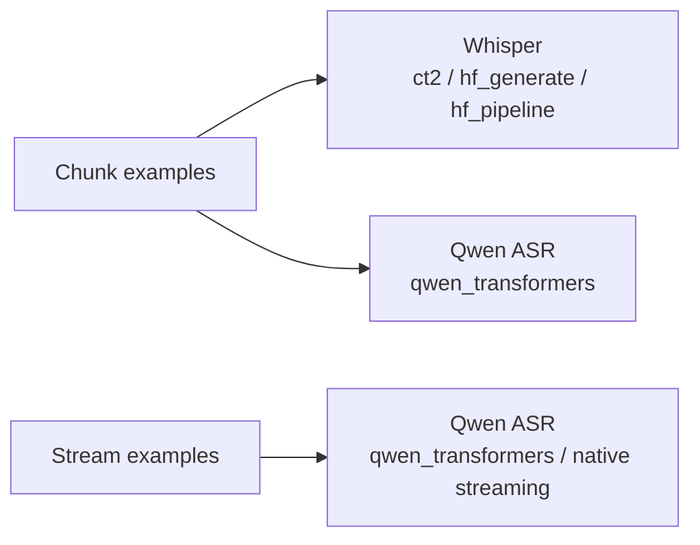
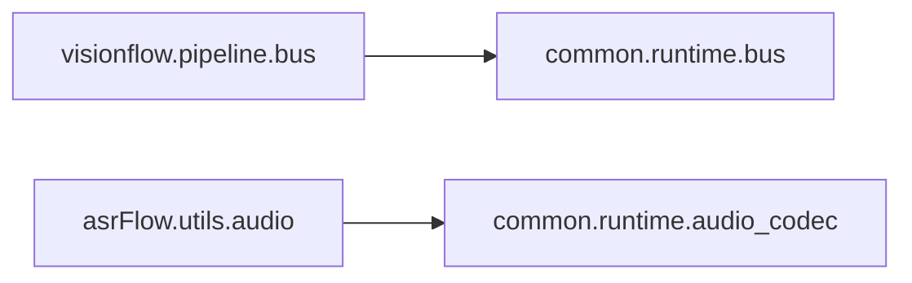

# NeuroFlow Architecture

## 1. Layer Ownership

핵심 해석:

- `common`은 공용 기반층이다.
- `voiceFlow`는 오디오 ingress와 edge를 소유한다.
- `asrFlow`는 순수 ASR 코어를 소유한다.
- `neuroflow.app`은 조립과 실행 진입점만 맡는다.

## 2. Canonical Runtime Paths

## 3. Network ASR Server Flow

## 4. Public Entry Points

## 5. Model Experiment Split

현재 기준:

- `chunk` 예제는 일반 실험 UI다.
- `stream` 예제는 native streaming 지원 모델만 다룬다.
- 현재 canonical native streaming 경로는 `Qwen ASR + qwen-asr transformers backend`다.

## 6. Live Compatibility Surface

현재 소스 기준으로 문서화할 가치가 남아 있는 compatibility surface는 위 두 경로 정도다.
