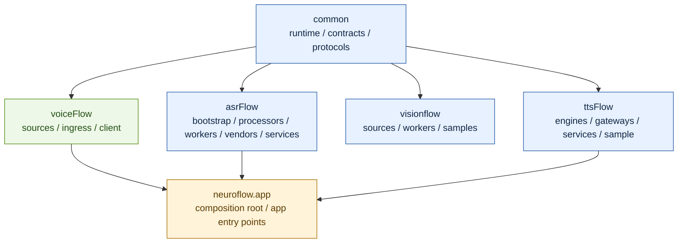
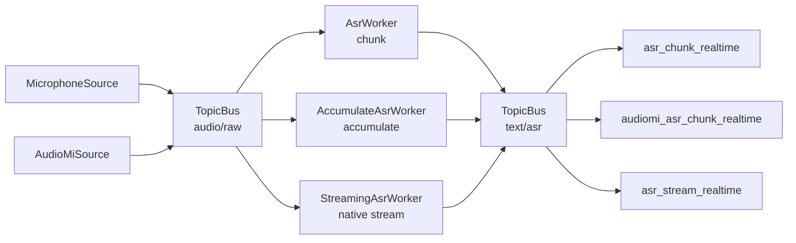
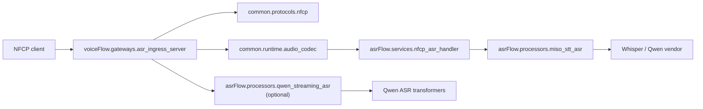
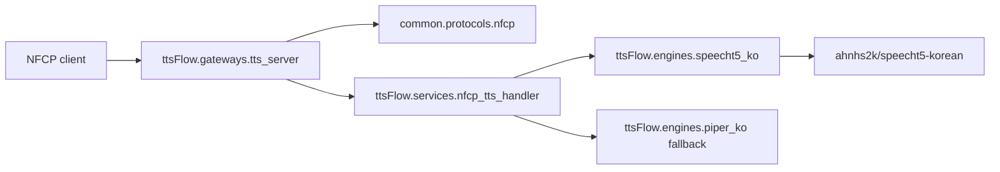
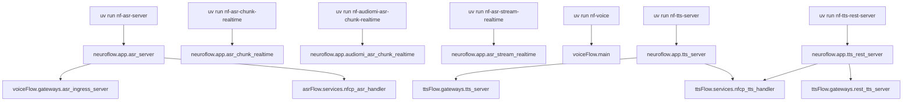
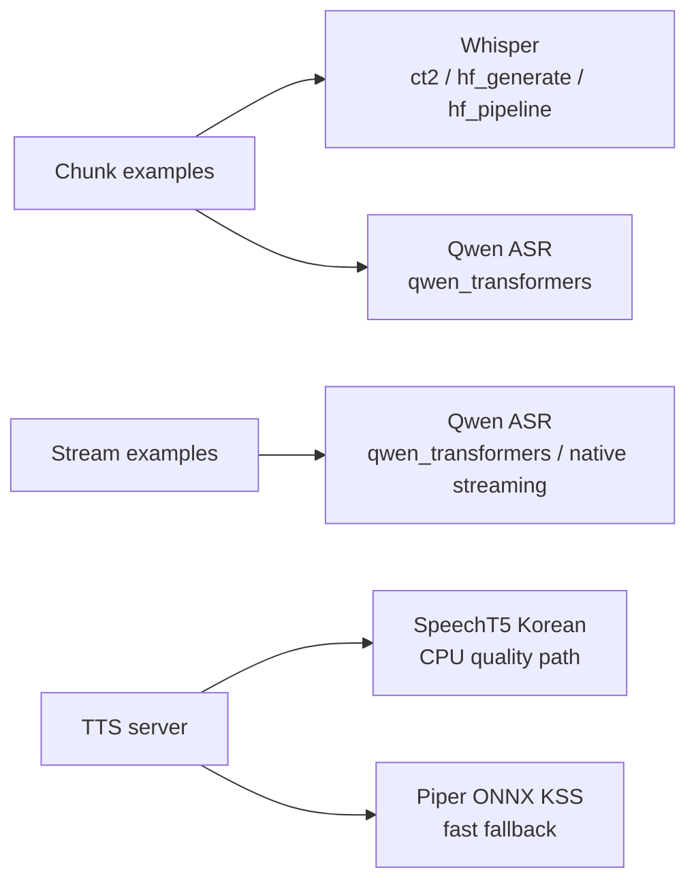
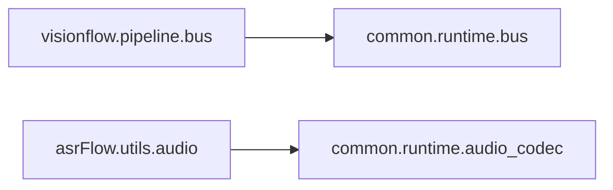

# NeuroFlow Architecture

## 목차

1. [최근 변경 초점](#최근-변경-초점)
2. [1. Layer Ownership](#1-layer-ownership)
3. [2. Canonical Runtime Paths](#2-canonical-runtime-paths)
4. [3. Network ASR Server Flow](#3-network-asr-server-flow)
5. [4. Public Entry Points](#4-public-entry-points)
6. [5. Model Experiment Split](#5-model-experiment-split)
7. [6. Live Compatibility Surface](#6-live-compatibility-surface)

## 최근 변경 초점

- `AsrIngressServer`는 이제 `PING`, `DESCRIBE`, `SERVER_INFO`, `ASR_TRANSCRIBE`를 기본 공통 표면으로 제공하고 streaming 활성 시 `ASR_TRANSCRIBE_STREAM`, `ASR_CLEAR_BUFFER`까지 노출한다.
- `TtsServer`를 추가해 `PING`, `DESCRIBE`, `SERVER_INFO`, `TTS_SYNTHESIZE`를 NFCP TCP로 제공하고, `tts_rest_server`를 외부 HTTP gateway로 제공한다.
- 운영 메타 조회와 capability 조회를 분리해 `SERVER_INFO`는 host/port/pid/uptime 중심, `DESCRIBE`는 지원 포맷과 기본값 중심 응답으로 정리했다.
- `QwenStreamingAsrProcessor`는 bounded accumulation과 명시적 `reset()` 지점을 가져 stream 세션 종료 후 잔존 상태를 줄였다.

## 1. Layer Ownership

핵심 해석:

- `common`은 공용 기반층이다.
- `voiceFlow`는 오디오 ingress와 edge를 소유한다.
- `asrFlow`는 순수 ASR 코어를 소유한다.
- `ttsFlow`는 TTS engine, NFCP/REST gateway, sample client를 소유한다.
- `neuroflow.app`은 조립과 실행 진입점만 맡는다.

## 2. Canonical Runtime Paths

## 3. Network ASR Server Flow

운영 제어 메모:

- `SERVER_INFO(102)`는 서버 버전과 런타임 상태를 별도 조회하는 공통 진단 경로다.
- `ASR_CLEAR_BUFFER(1003)`는 모델을 내리지 않고 streaming processor 상태만 비우는 운영 커맨드다.
- `ASR_TRANSCRIBE_STREAM`의 `action=end`는 마지막 결과를 내보낸 뒤 processor를 바로 `reset()`한다.

### Network TTS Server Flow

운영 제어 메모:

- 기본 command는 `TTS_SYNTHESIZE(3001)`이며 응답 data는 WAV bytes다.
- REST gateway는 `POST /tts`에서 JSON text를 받고 `audio/wav`를 반환한다.
- 기본 모델은 `ahnhs2k/speecht5-korean`이며, GPU 여유 메모리를 보호하기 위해 `NF_TTS_DEVICE=cpu`를 기본값으로 둔다.
- Piper ONNX KSS 모델은 빠른 fallback 경로로 남겨둔다.

## 4. Public Entry Points

## 5. Model Experiment Split

현재 기준:

- `chunk` 예제는 일반 실험 UI다.
- `stream` 예제는 native streaming 지원 모델만 다룬다.
- 현재 canonical native streaming 경로는 `Qwen ASR + qwen-asr transformers backend`다.
- TTS 서버는 한국어 `speecht5-ko`를 CPU 기본값으로 다루며, Piper ONNX KSS는 fallback이다.

## 6. Live Compatibility Surface

현재 소스 기준으로 문서화할 가치가 남아 있는 compatibility surface는 위 두 경로 정도다.
